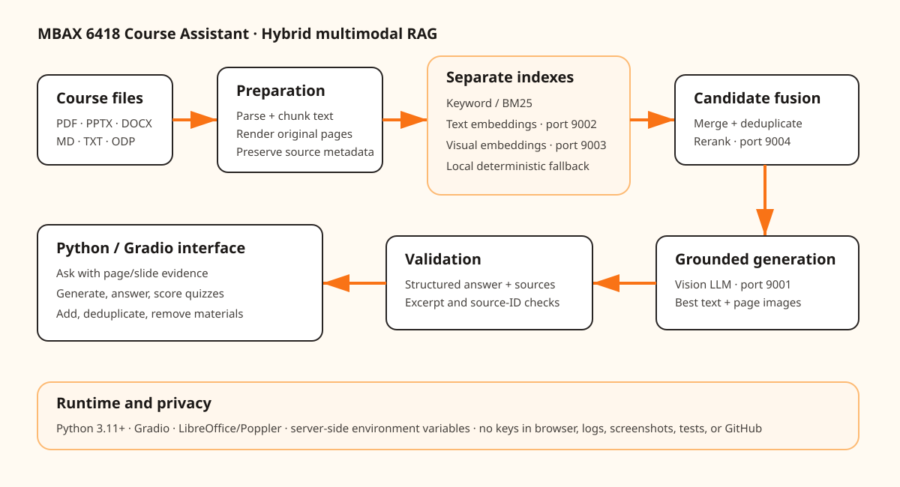

# MBAX 6418 Course Assistant

A Python/Gradio app that answers questions and creates practice quizzes from uploaded course decks. Every supported claim is tied to an exact excerpt and page/slide image; missing information produces an explicit “not found” response.



## Quick start

Requirements: Python 3.11+, Poppler (`pdftoppm`), and LibreOffice (`soffice`) for rendering PowerPoint decks.

```bash
python3 -m venv .venv
source .venv/bin/activate
pip install -r requirements.txt
cp .env.example .env
python scripts/build_index.py "/path/to/course files"
python app.py
```

Open `http://127.0.0.1:8060`. Add files in the sidebar, select course material, optionally enter a topic, then ask a question or generate a quiz. Removing a material rewrites the searchable index and removes unused rendered assets. Uploading the same document again—even from another folder—is detected by content metadata and does not duplicate it.

For public deployment, `Dockerfile` and `render.yaml` configure a Render web service. Add `CLASS_API_KEY` only through Render's secret environment-variable settings; never commit `.env`. Free services can sleep after inactivity and take approximately a minute to wake.

Keep the class key only in `.env`. It is server-side and ignored by Git; never put a real key in UI code, screenshots, logs, tests, or commits. `.env.example` contains dummy placeholders.

## Accepted files and conversion

| Input | Searchable text | Visual evidence |
|---|---|---|
| PDF | Per page | Rendered original page PNG |
| PPTX / PPT / ODP | Per slide | LibreOffice → PDF → slide PNG |
| DOCX | Per nonempty paragraph | Not rendered (limitation) |
| Markdown / TXT | Per section | Not applicable |

Maximum upload size is 150 MB per file. Visually inspect rendered pages after conversion, especially charts, fonts, and animations; animations become static. Scanned PDFs need OCR, which is not yet automatic.

## Retrieval and generation

The repeatable offline baseline combines BM25-style lexical scoring and deterministic vector scoring while keeping text and visual records distinct. Relevant image records receive a visual-query boost. Candidate evidence—text plus original page images—is sent to the class vision model. The app validates structured `answer` and `sources` fields, allows only retrieved source IDs, and verifies excerpts occur in cited content.

| Purpose | Endpoint | Model |
|---|---|---|
| Vision generation | `http://dobolyi.com:9001/v1/chat/completions` | `cyankiwi/Qwen3.6-35B-A3B-AWQ-4bit` |
| Text embedding | `http://dobolyi.com:9002/v2/embed` | `nvidia/Nemotron-3-Embed-1B-BF16` |
| Visual embedding | `http://dobolyi.com:9003/v1/embeddings` | `Qwen/Qwen3-VL-Embedding-2B` |
| Multimodal reranking | `http://dobolyi.com:9004/rerank` | `Qwen/Qwen3-VL-Reranker-2B` |
| Document parsing | `http://dobolyi.com:9005/v1/chat/completions` | `dots.mocr` |

The vision-generation adapter is active. The offline hybrid index is the fallback when embedding or reranking services are unavailable. Production embedding/reranking adapters remain unchecked until their exact vLLM 0.29 request templates are exercised against the live class servers; this app does not silently invent a schema.

## Quiz behavior

Questions are generated only from retrieved evidence. The answer key is stored in server-side Gradio state and stays hidden until submission. Submission reports the score, correct answer, explanation, document, page/slide, and exact excerpt. Regenerating creates a new fixed key; changing a radio selection never changes it.

## Testing and evaluation

```bash
python -m unittest discover -s tests -v
```

Automated checks cover retrieval, citation enforcement, source hydration, fixed answer keys, missing-information fallback, duplicate uploads from different paths, and removal from the searchable index. Manual checks still required before submission: light/dark UI, service outage behavior in-browser, direct PPTX conversion fidelity, the Week 2 “Vibe Coding on Prod” meme answer with its image, and quiz feedback with a source image.

A development defect and its reproduction, expected behavior, actual behavior, fix, and regression test are recorded in [`docs/bug-report-missing-information.md`](docs/bug-report-missing-information.md).

The hero-banner contrast defect shown during UI review is documented separately in [`docs/bug-report-hero-contrast.md`](docs/bug-report-hero-contrast.md).

The fixed seven-question set in `evaluation/questions.json` spans slides, two visual questions, the required meme, and one unanswerable question. Compare on the same files/questions:

1. Lexical-only BM25 baseline.
2. Hybrid keyword + text/visual vectors + multimodal reranking.

Record answer correctness, source support, and latency for each question. Hybrid is the recommended production choice because visual questions need image similarity and reranking, but no comparative result is claimed until the live evaluation runs. Save raw results under `evaluation/results/` and add the resulting table here.

## Submission checklist

- [x] Python app; add, deduplicate, select, and remove materials.
- [x] PDF/PPTX and supporting formats; source metadata and original rendered visuals preserved.
- [x] Grounded multimodal answers, structured sources, validation, and missing-info fallback.
- [x] Multiple-choice quizzes with fixed hidden keys, scoring, explanations, and excerpts.
- [x] SVG architecture showing preparation, retrieval paths, reranking, services, and runtime.
- [x] Automated core tests and seven-question evaluation set.
- [ ] Run and record the two-approach comparison against live services.
- [ ] Add two final screenshots: an answer with slide image and quiz feedback with sources.
- [ ] Confirm the syllabus is included in the index.
- [ ] Create/assign issues from `docs/github-issues.md`; use branches, commits, PRs, and teammate review.
- [ ] Verify teammate repository access and submit the repository link.

The unchecked items require live service runs, the team’s syllabus/repository, or teammate actions and must not be represented as complete.

## Team workflow and limitations

Use `docs/github-issues.md` as the backlog. Assign owners, work one issue per branch, attach tests to each pull request, and have another teammate review. An issue is a task record; a branch is an isolated line of work; a pull request is a proposed reviewed merge.

DOCX paragraphs currently have no original-page screenshot. Scanned PDFs need OCR. Slide animations and video are static after conversion. The deterministic vector baseline is not a substitute for the class embedding services. Model outputs can still be wrong, so inspect the shown excerpt and original image.
